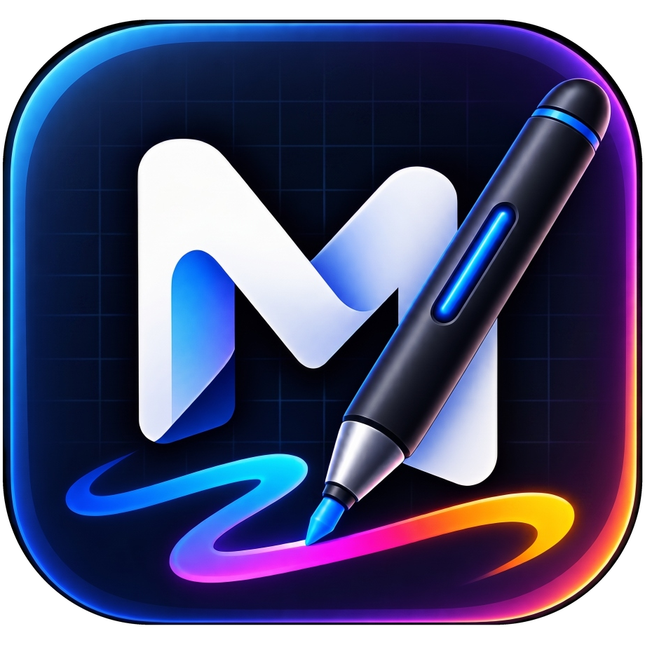

# MaliPen 🎨

<div align="center">
  
  <h3>Your Screen. Your Canvas.</h3>
  <p>Production-quality screen annotation, drawing, and presentation tool for macOS & Windows.</p>

  <p>
    <a href="https://pen.maliyildirimtr.com"></a>
    <a href="https://github.com/maliyildirimtr/MaliPen/releases/latest"></a>
    <a href="https://github.com/maliyildirimtr/MaliPen/blob/main/LICENSE"></a>
  </p>
</div>

---

## ✨ Features

- 🖊️ **Freehand Drawing:** Smooth, pressure-sensitive drawing directly over any desktop screen.
- 📐 **Shapes & Tools:** Arrows, rectangles, circles, highlighters, and text annotations.
- ⚡ **Zero Friction:** Instant hotkeys to toggle draw mode, clear screen, and take screenshots.
- 🍏 **macOS & 🪟 Windows:** Native cross-platform desktop installers.
- 🔄 **Auto-Updates:** Seamless background updates via GitHub Releases.

## 🚀 Downloads

Download the latest version directly from our website or GitHub Releases:

- **macOS:** [Download .dmg](https://github.com/maliyildirimtr/MaliPen/releases/latest/download/MaliPen-mac.dmg)
- **Windows:** [Download .exe (Setup)](https://github.com/maliyildirimtr/MaliPen/releases/latest/download/MaliPen-windows.exe)

## 🛠️ Development

```bash
# Install dependencies
npm install

# Start development overlay & electron
npm run dev

# Build production bundle
npm run build
```

## 📖 Documentation

Internal logs, roadmaps, and audit reports are located in the [`docs/`](./docs) folder.

---

<div align="center">
  <sub>Created with ❤️ by <a href="https://maliyildirimtr.com">Mali Yıldırım</a></sub>
</div>
